A markdown file reporting:
- an explanation of your sanity checks, including what you expected and what happened; **(5 pts)**
- a state-space plot showing the RoA of every stable attractor, including fixed points and limit cycles; **(5 pts)**
- your one-dimensional return-map plot, with its fixed point and the identity line clearly marked; and **(5 pts)**
- visualization and discussion of how the slope and number of spokes affects the RoA and local convergence **(10 pts)**

## explanation of sanity checks
First sanity check: conservation of energy. I started the wheel at theta = 0.1 (non-vertical start angle) with an initial velocity of 0.5 rad/s. I expected the total energy to stay perfectly constant.
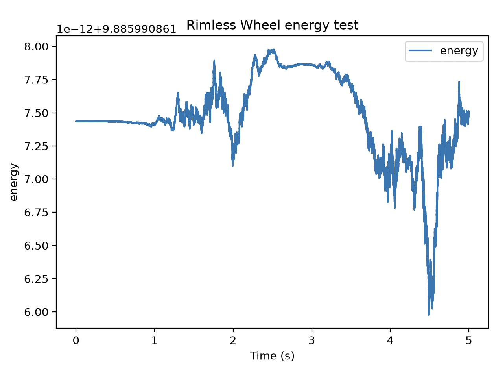
I was fairly alarmed until i saw the bounds on the y-axis. With limits set, it's clear the total energy remains perfectly constant. The noise in the image above likely comes from numerical error stemming from the rk4 integrator.
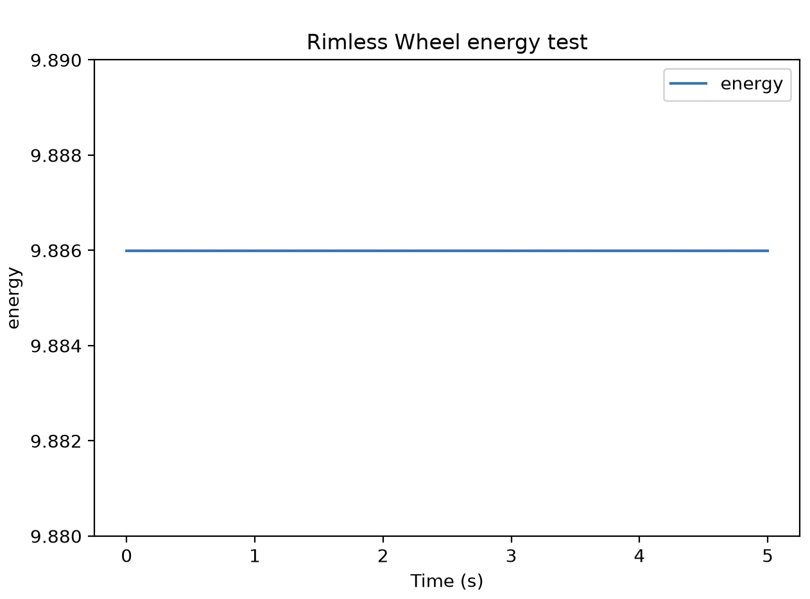

My next sanity check was to verify that my guard was triggering at the right time and the inelastic collision correctly dissipates energy. I set the slope to zero and gave it an initial velocity of 3 rad/s. Then plotted both total energy and angular velocity over time.
Expected the gaurd to trigger exactly when theta = alpha (the half angle), then theta instantly jumps up to -alpha. Additionally, the total energy remains perfectly flat during the continous swing and drops vertically at the moment of impact. Because slope is zero and energy is continually lost, the wheel will eventually fail to get back tot eh theta = 0 veritical positon and falls backward, to where it rests with zero velocity.
Shown in the plot before, my dynamics and event guard were working perfectly.
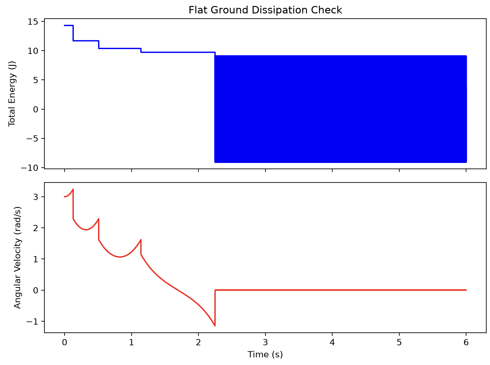

The last sanity check I did was to check if the system moves toward a limit cycle. I set a small downard slope and started the week at the post impact state with theta = -alpha, with an initial velocity of 3 rad/s. I then plotted the phase portrait.
I expected to see the system moving towards a stable closed loop where the pre- and post-impact velocitys become close to identical every step.
This is exactly what I saw.
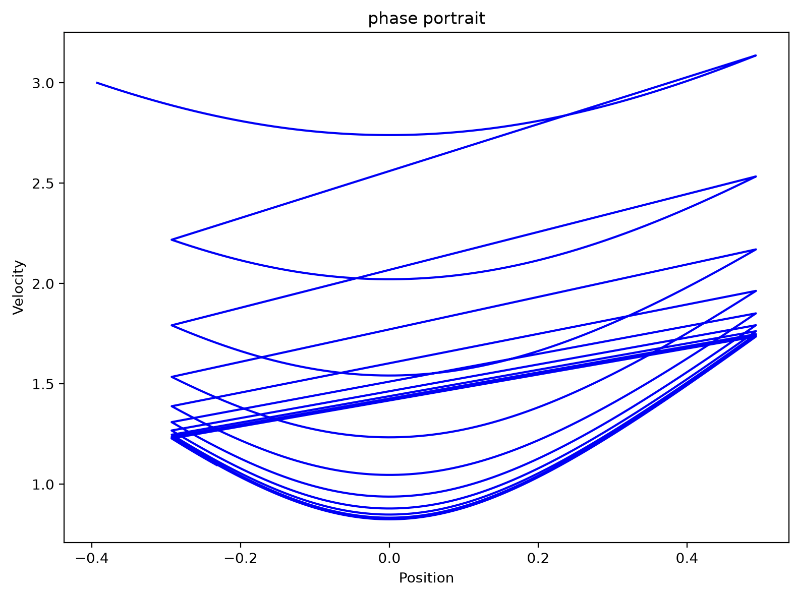

## state-space plot showing RoA of every stable attractor
Rolling is limit cycle and dead stop is fixed point.
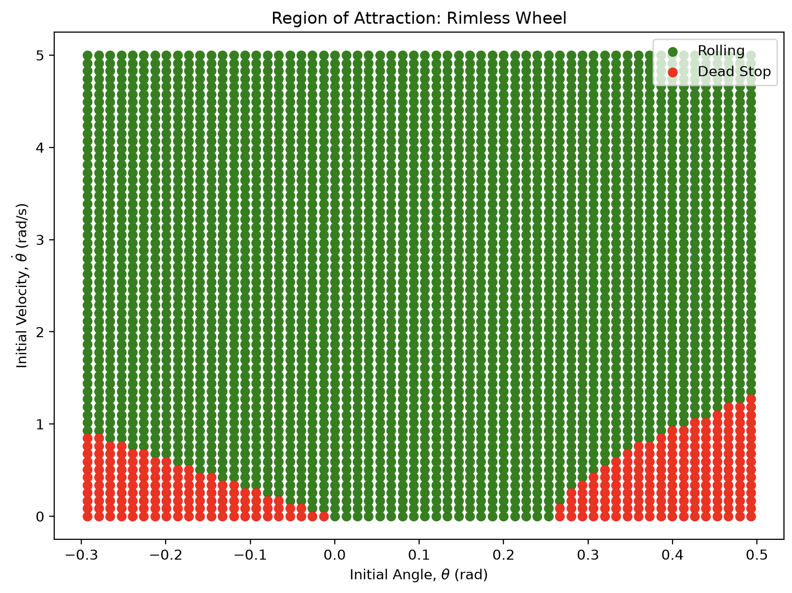

## return-map plot
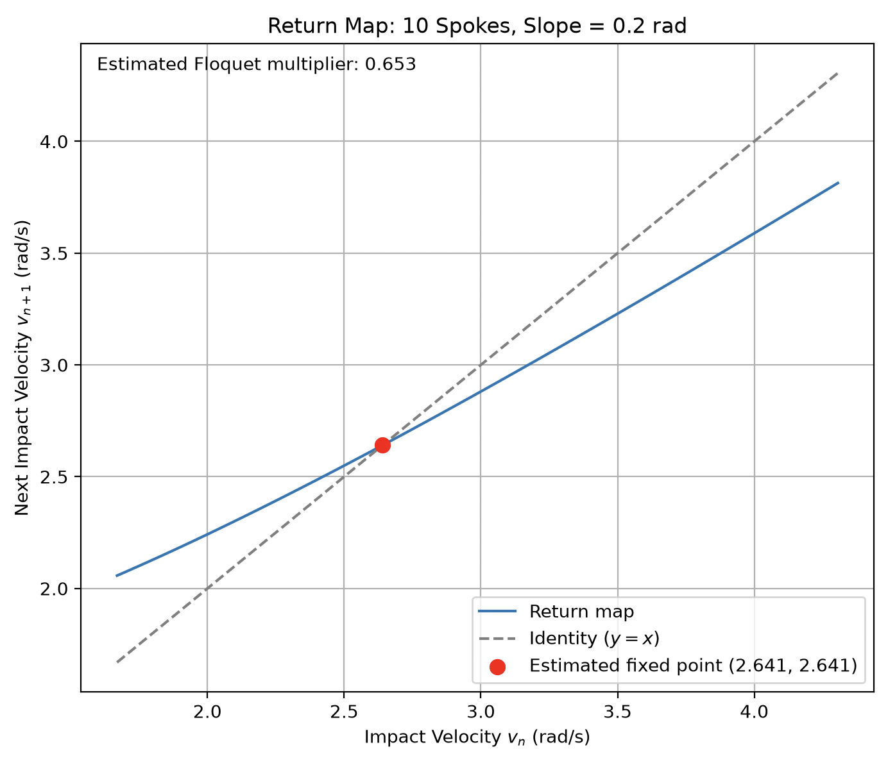

## Visualization and discussion of slope and spokes affects the RoA and local convergence
Below are six plots. The first two shows the overlayed return maps from all values in the two respective sweeps. The third and fourth shows how the Floquet Multiplier changes as a function of number of spokes and inclination, respectively. The fifth and sixth shows how the fixed velocity changes as a function of number of spokes and inclination, respectively.

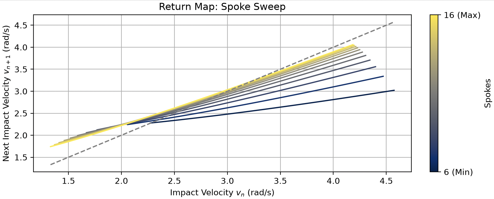
The return map shows that more spokes leads to larger slopes at the intersection point (see floquet multiplier section below). Furthermore, as the spoke amount increases, the intersection points moves to the right. Thus the steady state impact velocity increases with spoke count (collision angle is shallower with mroe spokes which leads to less kinetic energy dissapated during each impact). The return map also tells us a lot about how number of spokes affects the region of attraction. The dark blue line representing 6 spokes extends further to the right and less to the left than yellow line representing 16 spokes. Thus fewer spokes can tolerate higher speeds but needs a higher minimum initial velocity.
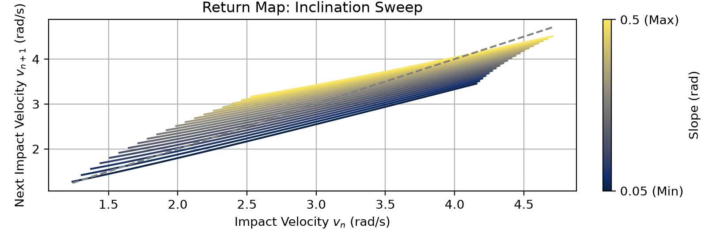
Theres a clear positive shift upward and to the right of the return map as the slope increases. This doesn't change the size of the stability regions in the region of attraction, but just also shifts it. A wheel on a steeper slope would stall out at an impact velocity that would be stable on a less steep slope.
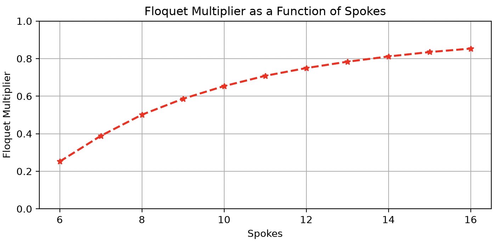
Adding more spokes to the wheel greatly increases the Floquet multiplier. With 16 spokes, the multiplier is around 0.85 while at 6 spokes its around 0.25. The Floquet multiplier is a measure of system stability, with perturbations decaying fastest in systems with Floquet multipliers closer to zero, and slower (or not at all) in system with Floquet multipliers closer to one (or greater than one). Therefore a wheel with fewer spokes can recover from any kinetic perturbations much faster.

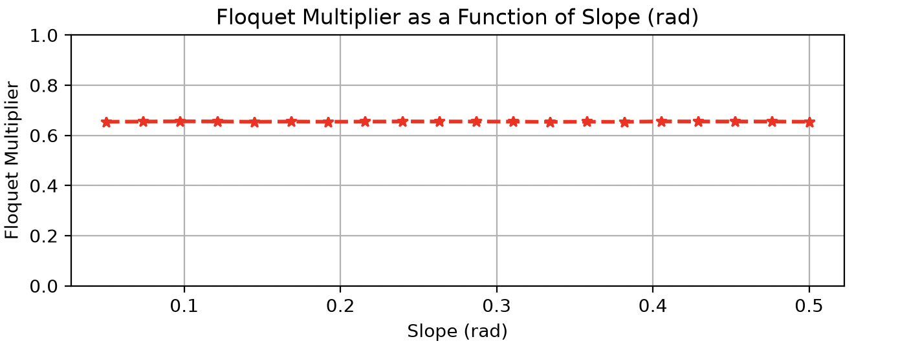
Slope does not seem to have much of an effect on the Floquet multiplier. The local convergence and error recovery is unaffected by any increase in potential energy. I would've thought that the higher speeds as the slope gets steeper would impact the stability of the system more, but maybe since the collision geometry is unaffected it doesn't matter?
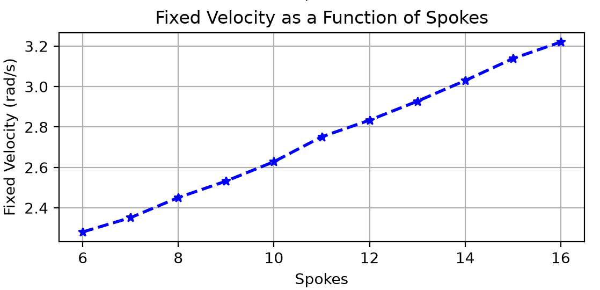
Spoke amount is nearly linearly porportional to the fixed velocity at impact. As the number of spokes increase. As mentioned above, more spokes leads to higher steady-state rolling velocities.
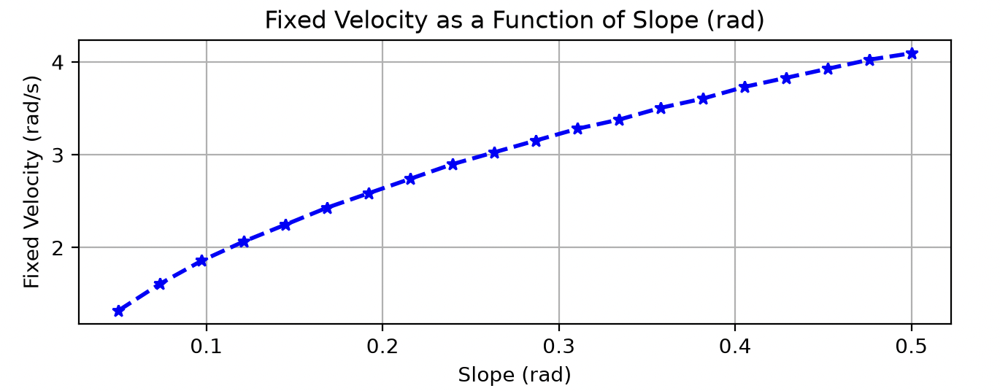
The fixed velocity increases concavely with the slope. This makes sense given that potential energy is gained from the steeper slope, but at hgiher velocities, more kinetic energy will be lost at each impact. Delicate balance that shifts with inclination angle.

